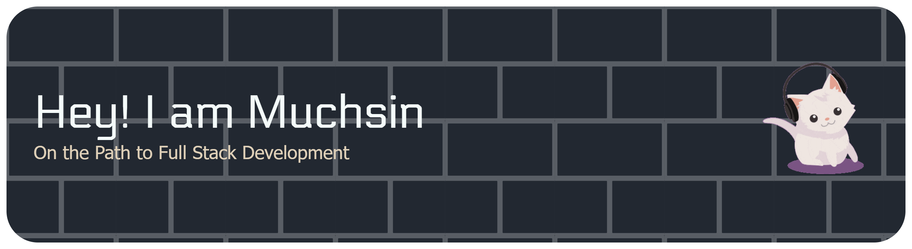

<!-- ## Hi there I'am Muchsin 👋 -->

## 🚀 About Me
- 🎓 I’m an Informatics student with a strong passion to become a **Full Stack Developer**.  
- 🌱 Currently learning **modern web development**  
- 🎯 Goal: To master **Full Stack Development** and contribute to impactful projects  
- ⚡ Fun fact: I can spend hours debugging without realizing the time 😅  

## 🌐 Socials:
 

# 💻 Tech Stack:
**Languages:**  

**Frameworks & Tools:**  

# 📊 GitHub Stats:
 
 

## 🏆 GitHub Trophies

<picture>
  <source media="(prefers-color-scheme: dark)" srcset="https://raw.githubusercontent.com/MuchsinHJ/MuchsinHJ/output/pacman-contribution-graph-dark.svg">
  <source media="(prefers-color-scheme: light)" srcset="https://raw.githubusercontent.com/MuchsinHJ/MuchsinHJ/output/pacman-contribution-graph.svg">
  
</picture>